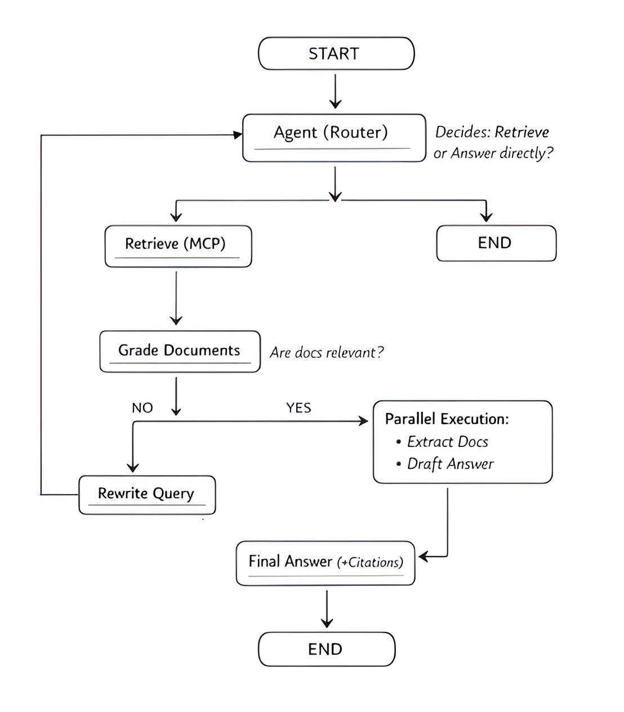
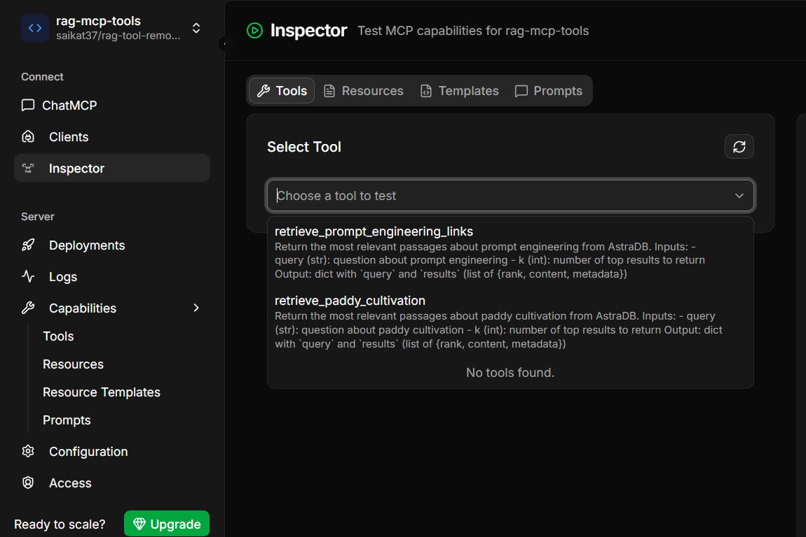
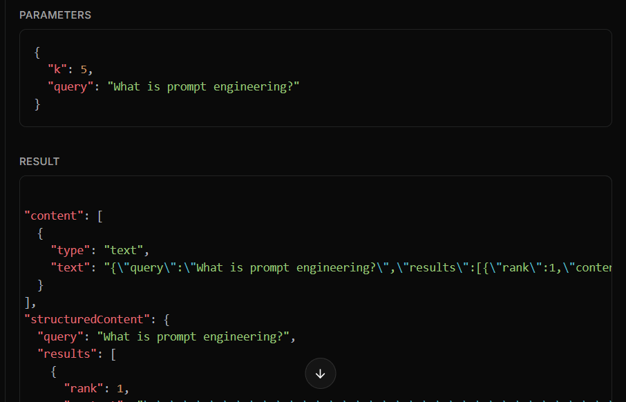
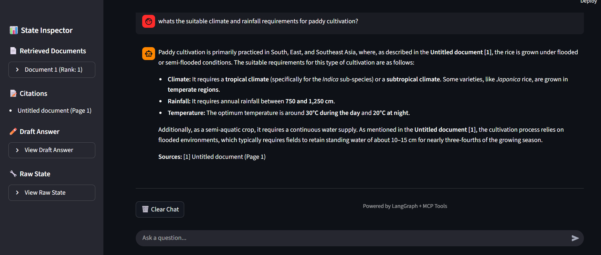
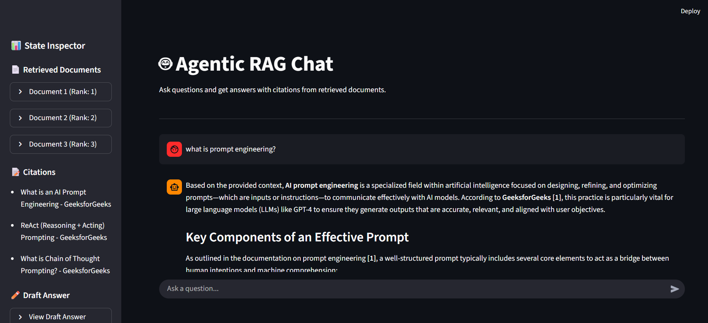
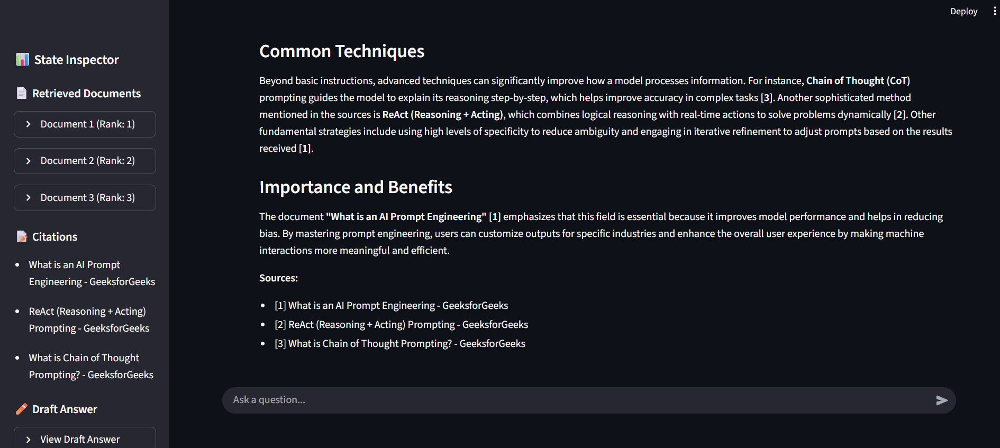
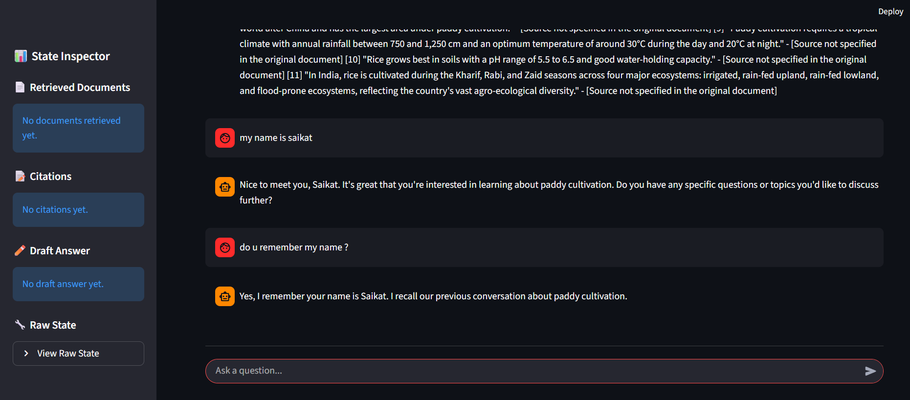
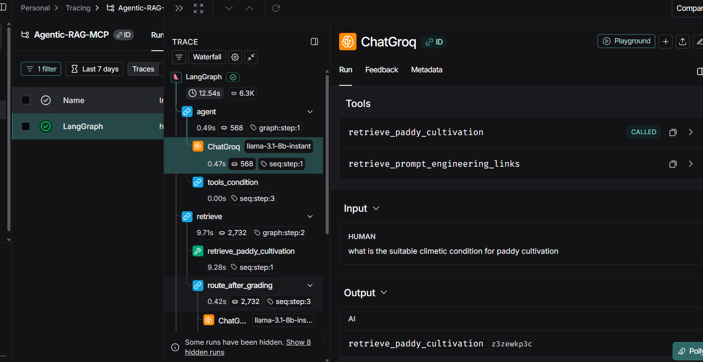

# 🤖 Agentic RAG System with LangGraph & MCP

An intelligent Retrieval-Augmented Generation (RAG) system powered by **LangGraph** that dynamically routes queries through specialized agents, retrieves relevant documents from remote MCP servers, grades document relevance, and generates answers with inline citations.

---

## 🚀 Setup & Installation

### Prerequisites

- **Python 3.10+**
- **uv** (recommended) or pip
- **API Keys**: Set up your environment variables for LLM providers (Groq, Google Gemini, etc.)

### Installation with `uv`

[uv](https://github.com/astral-sh/uv) is a fast Python package installer and resolver. Install it first:

```bash
# Install uv (Windows)
powershell -c "irm https://astral.sh/uv/install.ps1 | iex"

# Install uv (macOS/Linux)
curl -LsSf https://astral.sh/uv/install.sh | sh
```

Then install the project:

```bash
# Clone the repository
git clone https://github.com/saikat37/Agentic-RAG-With-MCP.git
cd Agentic-RAG-With-MCP

# Create virtual environment with uv
uv venv

# Activate virtual environment
# Windows
.venv\Scripts\activate

# macOS/Linux
source .venv/bin/activate

# Install dependencies
uv add -r requirements.txt

# Or install in editable mode
uv pip install -e .
```

### Installation with pip (Alternative)

```bash
# Create virtual environment
python -m venv .venv

# Activate
.venv\Scripts\activate  # Windows
source .venv/bin/activate  # macOS/Linux

# Install dependencies
pip install -r requirements.txt
```

### Environment Variables

Create a `.env` file in the project root:

```env
# LLM Provider API Keys
GROQ_API_KEY=your_groq_api_key
GOOGLE_API_KEY=your_google_api_key

# Optional: Configure which LLM provider to use
LLM_PROVIDER=groq  # or google
```

---

## 🏃 How to Run

### Run Streamlit App

```bash
streamlit run app.py
```

The app will open in your browser at `http://localhost:8501`

### Run from Python Script

```python
from src.graph import chatbot
from langchain_core.messages import HumanMessage

# Prepare query
initial_state = {
    "messages": [HumanMessage(content="What is prompt engineering?")],
    "documents": [],
    "citations": [],
    "draft_answer": ""
}

# Configure with thread ID for memory persistence
config = {"configurable": {"thread_id": "1"}}

# Run the chatbot
response = chatbot.invoke(initial_state, config=config)

# Get answer
print(response["messages"][-1].content)
```

---

## 🌐 Remote MCP Server Integration

## RAG Pipeline

Simple strategy (concise):

- Document ingestion: WebLoader, PyPDFLoader
- Chunking: RecursiveCharacterTextSplitter with `chunk_size=1000` and `chunk_overlap=100`
- Embeddings: Gemini embedding model (e.g., `models/text-embedding-004`)
- Vectorstore: AstraDB (topic-separated collections)
- Retrieval: MMR retrieval technique, return top_k = 5 (recommended `fetch_k` ~ 20)

Notes: compute embeddings once and reuse; update collections incrementally with `add_documents()`.

## 🌐 Remote MCP Server Integration

This system leverages a **remote MCP (Model Context Protocol) server** for document retrieval and knowledge-based tools.

### MCP Server Details

- **Repository**: [rag-tool-remote-mcp](https://github.com/saikat37/rag-tool-remote-mcp)
- **Hosted on**: [FastMCP Cloud](https://fastmcp.cloud/) 
- **Server URL**: `https://rag-mcp-tools.fastmcp.app/mcp`

### Available RAG Tools

The remote MCP server provides two specialized knowledge retrieval tools:

1. **`retrieve_prompt_engineering_links`**  
   - Retrieves documents and links related to prompt engineering best practices
   - Returns structured content with sources, metadata, and rankings
   - Ideal for queries about AI prompting, LLM optimization, and instruction design

2. **`retrieve_paddy_cultivation`**  
   - Retrieves agricultural knowledge about paddy (rice) cultivation
   - Provides information on farming techniques, crop management, and best practices
   - Returns structured agricultural documents with metadata

### Integration Code

The MCP client is configured in [`src/agents.py`](src/agents.py):

```python
from langchain_mcp_adapters.client import MultiServerMCPClient

# Configure MCP client with remote server
client = MultiServerMCPClient(
    {
        "document": {
            "transport": "http",
            "url": "https://rag-mcp-tools.fastmcp.app/mcp"
        }
    }
)

# Load tools from MCP server
mcp_tools = run_async(client.get_tools())
tools = mcp_tools
llm_with_tools = llm.bind_tools(tools)
```

The system automatically discovers and binds these tools to the LLM, allowing the agent to invoke them dynamically based on user queries.

### MCP Cloud Deployment

The MCP server is deployed on **[MCP Cloud](https://mcp.run)**, which provides:
- Scalable hosting for MCP servers
- HTTP/SSE transport support
- Automatic tool discovery and schema validation
- Monitoring and logging capabilities

---

## 🔄 LangGraph Workflow Architecture

### Overview

The system uses **LangGraph** to orchestrate a multi-agent workflow with conditional routing, parallel execution, and memory persistence. The workflow intelligently decides whether to retrieve documents, grades their relevance, and generates answers with citations.

### Agent Flow Diagram



### State Schema

```python
class ChatState(TypedDict):
    messages: Annotated[list[BaseMessage], add_messages]
    documents: list[DocumentInfo]  # Retrieved docs with metadata
    citations: list[str]           # Formatted citations
    draft_answer: str              # Draft before citation enrichment
```

### Agents & Nodes

#### 1. **Agent (Router)**
- **File**: [`src/agents.py:agent()`](src/agents.py)
- **Purpose**: Entry point that decides whether to retrieve documents or answer directly
- **Logic**: Uses LLM with tool binding to determine if MCP tools should be invoked
- **Output**: Either tool call (retrieve) or final answer

#### 2. **Retrieve (Tool Node)**
- **File**: [`src/agents.py:tools`](src/agents.py)
- **Purpose**: Executes MCP tool calls to retrieve documents from remote server
- **Tools Used**: 
  - `retrieve_prompt_engineering_links`
  - `retrieve_paddy_cultivation`
- **Output**: Raw tool messages with document payloads

#### 3. **Grade Documents**
- **File**: [`src/agents.py:grade_documents()`](src/agents.py)
- **Purpose**: Evaluates if retrieved documents are relevant to the query
- **Logic**: Uses LLM with structured output to score relevance as "yes" or "no"
- **Routing**:
  - **"yes"** → Parallel execution of `extract_docs` + `draft_answer`
  - **"no"** → `rewrite` query and retry

#### 4. **Rewrite Query**
- **File**: [`src/agents.py:rewrite()`](src/agents.py)
- **Purpose**: Reformulates the query to improve retrieval results
- **Logic**: Uses LLM to rephrase question with better semantic intent
- **Output**: Improved query message (loops back to Agent)

#### 5. **Extract Docs (Parallel)**
- **File**: [`src/agents.py:extract_docs()`](src/agents.py)
- **Purpose**: Parses tool messages to extract structured document metadata
- **Extracts**:
  - Document content
  - Source filename
  - Page numbers
  - Ranking scores
  - Titles
- **Output**: Updates `documents` and `citations` in state

#### 6. **Draft Answer (Parallel)**
- **File**: [`src/agents.py:draft_answer()`](src/agents.py)
- **Purpose**: Generates initial answer based on retrieved documents
- **Logic**: RAG chain with prompt template
- **Output**: Draft answer text (stored in state)

#### 7. **Final Answer**
- **File**: [`src/agents.py:final_answer()`](src/agents.py)
- **Purpose**: Enriches draft answer with natural inline citations
- **Logic**: Uses LLM to add citations like "According to [Source]..."
- **Output**: Final polished answer with citation section

### Edge Logic

- **`tools_condition`**: Built-in LangGraph conditional that routes based on tool calls
- **`route_after_grading`**: Custom routing function ([`src/edges.py`](src/edges.py)) that:
  - Returns `[Send("extract_docs"), Send("draft_answer")]` if relevant (parallel fan-out)
  - Returns `[Send("rewrite")]` if not relevant

### Memory & Persistence

The system uses **MemorySaver** checkpointer for conversation persistence:

```python
from langgraph.checkpoint.memory import MemorySaver

memory = MemorySaver()
chatbot = workflow.compile(checkpointer=memory)
```

- **Thread ID**: Each conversation is tracked by a unique thread ID
- **Stateful**: Previous messages and context are preserved across invocations
- **Usage**: Pass `config={"configurable": {"thread_id": "1"}}` when invoking

### Citation System

Citations are intelligently formatted from document metadata:

```
Sources:
- What is an AI Prompt Engineering - GeeksforGeeks (Page 1)
- ReAct (Reasoning + Acting) Prompting - GeeksforGeeks (Page 2)
```

The final answer includes inline citations:
> "According to GeeksforGeeks, **AI prompt engineering** is a specialized field within artificial intelligence focused on designing, refining, and optimizing prompts..."

---

## 📸 Screenshots

### 1. MCP Cloud Deployment (Remote Server)

<table>
  <tr>
    <td>
      
    </td>
    <td>
      
    </td>
  </tr>
</table>

**Description**: The remote MCP server hosted on MCP Cloud showing:
- Active server status and health monitoring
- Available tools (`retrieve_prompt_engineering_links`, `retrieve_paddy_cultivation`)
- HTTP transport endpoint configuration
- Server logs and invocation metrics

---

### 2. Streamlit UI - Chat Interface & State Inspector

<table>
  <tr>
    <td>
      
    </td>
    <td>
      
    </td>
    <td>
      
    </td>
  </tr>
</table>

**Description**: Combined view showing the main chat interface alongside the state inspector. Includes:
- User query input
- Assistant response with inline citations
- Sidebar inspector with retrieved documents, citations, draft answer, and raw state for debugging

---

### 3. Persistent Memory



**Description**: Demonstrates that the application implements persistent conversation memory. Key points:
- Uses `MemorySaver` checkpointer to persist conversation state across runs
- Conversations are tracked by a `thread_id` so different sessions keep separate histories
- Persisted state includes messages, retrieved documents, citations, and draft answers

Example usage:
```python
from langgraph.checkpoint.memory import MemorySaver

memory = MemorySaver()
chatbot = workflow.compile(checkpointer=memory)

# When invoking, pass a thread id to persist/reuse the conversation
# config={"configurable": {"thread_id": "1"}}
```

---

## 🛠️ Project Structure

```
sowiz-agentic-rag/
├── src/
│   ├── agents.py          # Agent nodes & tool loading
│   ├── edges.py           # Routing logic
│   ├── graph.py           # LangGraph workflow definition
├── utils/
│   ├── model_loader.py    # LLM initialization
│   ├── config_loader.py   # YAML config parser
│   └── document_ops.py    # Document utilities
├── config/
│   └── config.yaml        # LLM and embedding config
├── exception/
│   └── custom_exception.py
├── logger/
│   └── custom_logger.py
├── app.py                 # Streamlit web interface
├── requirements.txt       # Python dependencies
├── pyproject.toml        # Project metadata
└── README.md             # This file
```
---

## 📦 Dependencies

Key packages:
- **LangGraph** (`0.3.6`): Workflow orchestration
- **LangChain** (`1.2.3`): LLM abstractions
- **langchain-mcp-adapters** (`0.2.1`): MCP client integration
- **Streamlit** (`1.52.2`): Web UI
- **langchain-groq** / **langchain-google-genai**: LLM providers

See [`requirements.txt`](requirements.txt) for full list.

---

## 🎯 Features

✅ **Multi-Agent Workflow**: Intelligent routing with LangGraph  
✅ **Remote MCP Tools**: Fetch knowledge from external servers  
✅ **Document Grading**: Automatic relevance assessment  
✅ **Query Rewriting**: Improves retrieval on failure  
✅ **Parallel Execution**: Extract docs + draft answer simultaneously  
✅ **Inline Citations**: Natural source attribution  
✅ **Memory Persistence**: Conversation history with thread IDs  
✅ **Streamlit UI**: Interactive chat with state inspection  

---

## 🧪 Testing

To test the system:

1. **Start Streamlit**:
   ```bash
   streamlit run app.py
   ```

2. **Ask a question**:
   - "What is prompt engineering?"
   - "Tell me about paddy cultivation techniques"

3. **Observe the flow**:
   - Check terminal logs for agent decisions
   - Inspect sidebar for retrieved documents
   - Verify citations in the answer

4. **Check memory persistence**:
   - Ask follow-up questions
   - Verify context is maintained across messages

---


## 🔍 Observability

This project includes observability support to capture agent decisions, tool calls, and traces. We integrate with Langsmith (LangChain's tracing/observability platform) to visualize runs, inspect tool usage, and diagnose agent behavior.



### Langsmith Setup

Add the following to your environment:

```env
# Langsmith integration
LANGSMITH_API_KEY="YOUR_LANGSMITH_API_KEY"  # keep this secret
LANGCHAIN_TRACING_V2=true
LANGCHAIN_ENDPOINT='https://api.smith.langchain.com'
LANGCHAIN_PROJECT='your-project-name'
```
---

## 🤝 Contributing

Contributions are welcome! Please:
1. Fork the repository
2. Create a feature branch (`git checkout -b feature/amazing-feature`)
3. Commit changes (`git commit -m 'Add amazing feature'`)
4. Push to branch (`git push origin feature/amazing-feature`)
5. Open a Pull Request

---

## 📄 License

This project is licensed under the MIT License.

---

## 🙏 Acknowledgments

- **LangGraph** for workflow orchestration
- **MCP Cloud** for remote tool hosting
- **LangChain** for LLM abstractions
- **Streamlit** for rapid UI development

---

## 📧 Contact

**Saikat Santra**  
GitHub: [@saikat37](https://github.com/saikat37)  
MCP Server Repo: [rag-tool-remote-mcp](https://github.com/saikat37/rag-tool-remote-mcp)

---

**Built with ❤️ using LangGraph, LangChain, and MCP**
